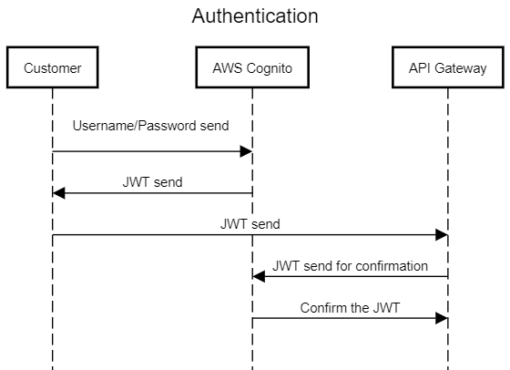
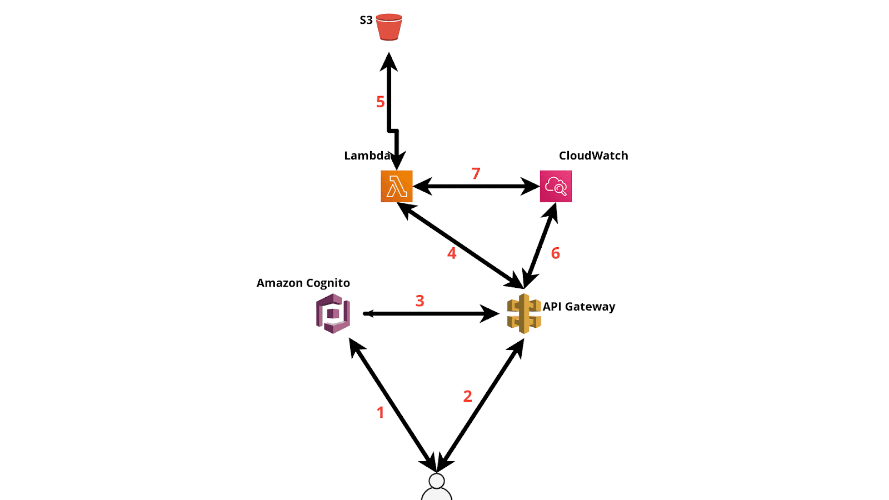

# Photo-Uploader

## About
PoC of a backend solution made in AWS Cloud for a Photo Uploader app.


Tech stack:
- Terraform 1.14
- Python 3.8+
- AWS CodeCommit
- AWS CodePipeline
- AWS Lambda
- AWS Cognito
- AWS API Gateway
- AWS S3

For automation we will use CodeCommit to keep the TF and Python code and CodePipeline to deploy it on AWS.
AWS CodeCommit and CodePipeline resources are required beforehand (manually create them).
CodePipeline will be using a [**buildspec.yml**](buildspec.yml) file that is to be found in the CodeCommit repo to automatically deploy the infrastructure after each git push.

The Terraform state will be saved in the **terraform-remote–state** S3 bucket.

## Authentication


1) The customer sends the credentials to Cognito.
2) Cognito validates them and sends back the JWT.
3) When the client tries to access the required API, it needs an access token that is obtained from JWT.
4) The API forwards the token to Cognito for validation.
5) Cognito sends the token confirmation back to the API.


## API Reference

###  Login
The /login endpoint returns a JWT token used for Api Gateway authentication.

```http
  POST /login
```

| Parameter | Type     | Description                |
| :-------- | :------- | :------------------------- |
| `username` | `string` | **Required**. BODY parameter for Cognito username (email) |
| `password` | `string` | **Required**. BODY parameter for Cognito user’s password |

Sample request:

```http
  POST https://ucm240nnie.execute-api.eu-central-1.amazonaws.com/test/login 
	-H "Content-Type: application/json"
	-d '{"username": "UserEmailAddress", "password": "UserPassword"}'
```

Sample response:

```json
    {
        "jwt": "token",
        "credentials": "UserEmailAdress"
    }

```

### Upload a single photo
Endpoint to upload a single photo to S3.
This endpoint requires that the JWT token is present in the headers.


```http
  POST /upload_single_photo
```

| Parameter | Type     | Description                       |
| :-------- | :------- | :-------------------------------- |
| `JWT`      | `string` | **Required**. JWT Token retrieved from the Login |
| `file`      | `data` | **Required**. BODY - the photo that is to be uploaded |


### Unzip
Endpoint to unzip the contents of a ZIP archive and upload the photos to S3
This endpoint requires that the JWT token is present in the headers.


```http
  POST /unzip
```

| Parameter | Type     | Description                       |
| :-------- | :------- | :-------------------------------- |
| `JWT`      | `string` | **Required**. JWT Token retrieved from the Login |
| `archive` | `data` | **Required**. BODY - the archive that is to be unpacked |


### Download
Endpoint to retrieve a photo from S3
This endpoint requires that the JWT token is present in the headers.


```http
  POST /download
```

| Parameter | Type     | Description                       |
| :-------- | :------- | :-------------------------------- |
| `JWT`      | `string` | **Required**. JWT Token retrieved from the Login |
| `filename` | `string` | **Required**. The photo filename to retrieve from S3 |


### List
Endpoint that returns a list of all user’s photos as JSON
This endpoint requires that the JWT token is present in the headers.

```http
  POST /list
```

| Parameter | Type     | Description                       |
| :-------- | :------- | :-------------------------------- |
| `JWT`      | `string` | **Required**. JWT Token retrieved from the Login |

### Delete
Endpoint to delete a photo from S3
This endpoint requires that the JWT token is present in the headers.


```http
  POST /delete
```

| Parameter | Type     | Description                       |
| :-------- | :------- | :-------------------------------- |
| `JWT`      | `string` | **Required**. JWT Token retrieved from the Login |
| `file` | `string` | **Required**. The photo filename to delete from S3 |

## Lambda.
There are 6 lambda functions. Each function serves a separate API.
These functions (except login) are sharing the JWT decoding code in a lambda layer.
The JWT decoding code extracts the username from the JWT

 
## Name convention for S3 Bucket
 
S3 bucket for photos will be called **yourplace**
In our bucket we will store only images. These objects will have a user-named part and in addition we will use a name convention timestamp that will be added automatically when the client uploads the file.
Timestamp will be added directly from the function to effectively remove overwriting of a document.


## Diagram & Logic



>1 -> User will send a request to cognito to create a username and a password.
> 
>2 -> Users will access an API. Here, the user will send the requested information.
> 
>3 -> Api Gateway will check with Cognito if the user exists or not.
> 
>4 -> A lambda will be triggered automatically when the user will access a specific API.
> 
>5 -> Lambda will upload/download/list as per request from API
> 
>6/7 -> Logs will be stored in CloudWatch.
